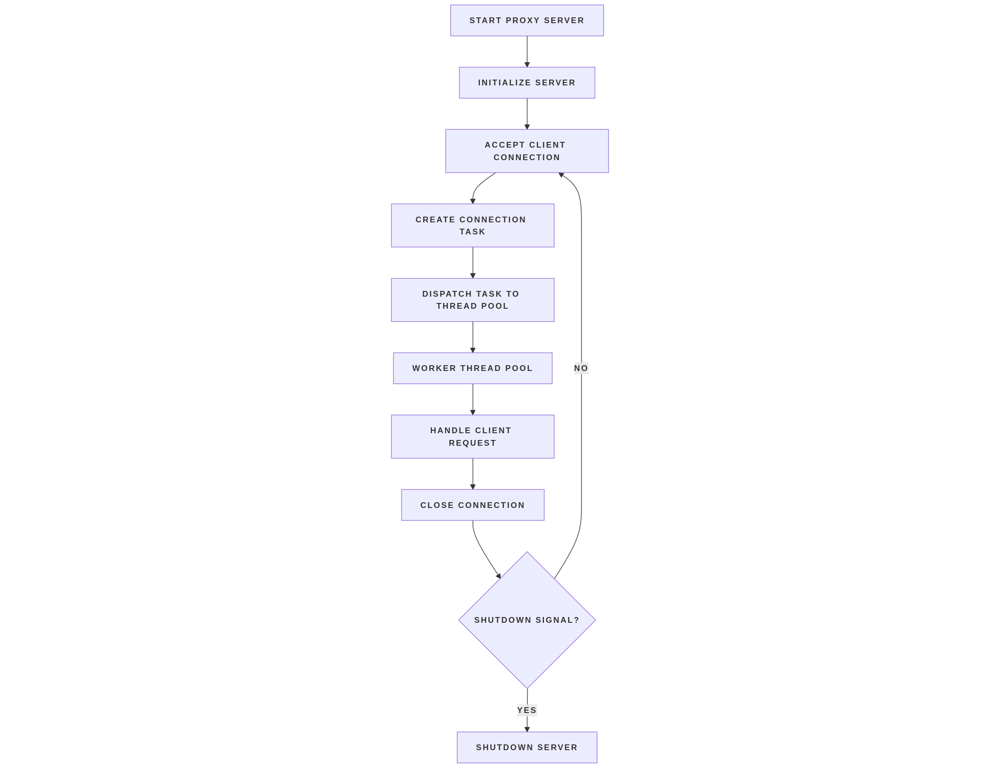
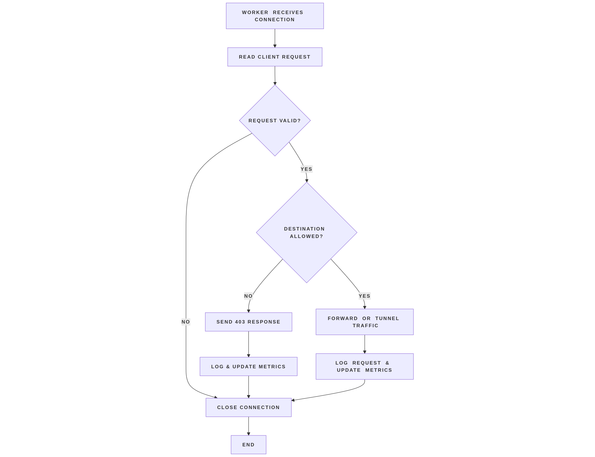
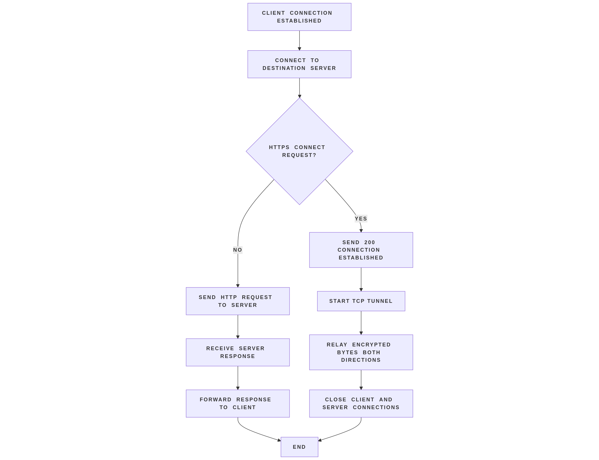

# Design and Architecture of the HTTP/HTTPS Proxy Server

This document describes the architectural design, execution model, and operational behavior of a custom **HTTP/HTTPS forward proxy server**. The intent of this document is to explain **how the system is structured**, **how requests move through the system**, and **why specific design choices were made**, while remaining aligned with the actual implementation.

---

## Architectural Overview

The proxy server is designed as a **modular, layered system** that separates connection acceptance, request processing, policy enforcement, and traffic forwarding. This separation improves clarity, correctness, and maintainability.

At a high level, the architecture consists of the following logical components:

- **Connection Acceptance Layer**  
  Responsible for creating a listening TCP socket and accepting incoming client connections using a blocking accept loop.  
  _(Implemented in `server.cpp`)_

- **Worker Execution Layer**  
  A fixed-size pool of worker threads that handle client connections from start to finish.  
  _(Implemented in `thread_pool.cpp` and `client_handler.cpp`)_

- **Request Processing Layer**  
  Parses HTTP requests, determines request type, and extracts destination metadata.  
  _(Implemented in `http_parser.cpp`)_

- **Policy Enforcement Layer**  
  Applies domain-based filtering rules to decide whether a request should be allowed or blocked.  
  _(Implemented in `blocklist.cpp`)_

- **Forwarding Layer**  
  Establishes outbound connections and forwards traffic between client and destination server.  
  _(Implemented in `forwarder.cpp`)_

- **Observability Layer**  
  Records logs and metrics for all requests.  
  _(Implemented in `logger.cpp` and `metrics.cpp`)_

<p align="center">
  
</p>
<p align="center"><em>Flowchart 1: Overall proxy server architecture</em></p>

---

## Source-Level Structure (Design Mapping)

The codebase reflects the architectural separation described above:

- `server.*` — blocking connection acceptance and task dispatch
- `thread_pool.*` — bounded worker execution model
- `client_handler.*` — per-connection request lifecycle controller
- `http_parser.*` — HTTP request parsing and CONNECT detection
- `blocklist.*` — traffic filtering logic
- `forwarder.*` — HTTP forwarding and HTTPS tunneling
- `logger.*` — structured logging
- `metrics.*` — runtime traffic statistics
- `config.*`, `global_config.*` — configuration loading and global runtime state

This mapping ensures that architectural boundaries are enforced at the code level.

---

## Concurrency Model and Execution Strategy

The proxy server uses a **thread-pool–based concurrency model with blocking I/O and timeouts**.

### Connection Acceptance

- The server runs a **blocking `accept()` loop** on the listening socket.
- Each accepted client connection is immediately encapsulated as a task and submitted to the worker pool.
- The accept loop itself does not process request data and is dedicated solely to connection acceptance.

### Thread Pool for Request Handling

- A **fixed-size thread pool** is created when the server starts and exists for the entire lifetime of the server.
- Each worker thread repeatedly retrieves tasks from a shared queue.
- A worker thread handles **one client connection at a time**, owning the connection from request parsing through forwarding and cleanup.
- All network I/O performed by workers uses blocking system calls.

### Role of Timeouts

To prevent worker threads from being indefinitely occupied by idle or slow clients, the server applies **socket-level timeouts**:

- Read and write timeouts ensure that blocking I/O operations do not stall forever.
- Connections that do not make progress within the configured timeout window are terminated.
- This mechanism allows the server to recover worker threads automatically, providing bounded resource usage even under adverse client behavior.

While the server uses blocking I/O, the combination of a fixed-size thread pool and strict timeouts ensures that the system remains responsive and does not get stuck handling idle or malicious clients.

### Rationale for This Model

This concurrency model was chosen to balance correctness, simplicity, and robustness:

**Advantages**

- Clear and predictable execution flow
- Bounded concurrency through a fixed-size thread pool
- Simpler reasoning and debugging due to blocking I/O
- Automatic recovery from idle or slow clients via timeouts
- Clean and deterministic shutdown behavior

**Trade-offs**

- Each active connection temporarily occupies a worker thread
- The design does not scale to extremely large numbers of concurrent idle connections

Though the model has certain limitations, it performs well within the given constraints.

---

## Request and Data Flow

Once a client connection is assigned to a worker, the request follows a clearly defined lifecycle:

1. **Socket Preparation**  
   Timeouts are applied to prevent stalled connections from consuming resources.

2. **Request Parsing**  
   The worker reads from the client socket until a complete HTTP header is received. Malformed requests are detected during parsing based on request-line structure and header validity. Requests that fail parsing are rejected immediately and do not proceed to policy enforcement or forwarding.

   The request line and headers are parsed to determine:

   - HTTP method
   - Destination host and port
   - Request type (standard HTTP or HTTPS CONNECT)

3. **Policy Decision**  
   The extracted destination host is checked against configured blocklist rules.

4. **Blocked Request Path**

   - A well-formed HTTP/1.0 `403 Forbidden` response with a textual message is returned
   - The request is logged and counted
   - The connection is closed

5. **Allowed Request Path**

   - An outbound TCP connection is established to the destination server
   - Protocol-specific forwarding logic is applied

6. **Protocol-Specific Forwarding**

   - **HTTP**: the request is forwarded and the response is streamed back to the client
   - **HTTPS CONNECT**: a TCP tunnel is established and encrypted bytes are relayed bidirectionally

7. **Accounting and Cleanup**

   - Traffic metrics are updated
   - Logs are written
   - Client and server sockets are closed

<p align="center">
  
</p>
<p align="center"><em>Flowchart 2: Request lifecycle, policy enforcement, and observability</em></p>

<p align="center">
  
</p>
<p align="center"><em>Flowchart 3: TCP forwarding and HTTPS CONNECT tunneling</em></p>

---

## Logging and Metrics

The proxy server records operational data through two persistent artifacts: a **log file** and a **metrics file**.

These files are written during runtime to support debugging, validation, and post-execution analysis. Logging and metrics are updated by worker threads during request handling and error paths in a thread-safe manner.

#### Log File

The log file records **event-level information** for each client connection and request. Log entries are appended sequentially to the configured log file, here "config/logs/proxy.log".

Each log entry follows a **single-line, structured text format**:

Example:

```
[2026-01-03 22:22:16] 127.0.0.1:56974 | "CONNECT  HTTP/1.0" | example.com:443 | ALLOWED | 200 | bytes=6105
[2026-01-04 00:10:41] 127.0.0.1:52424 | "CONNECT  HTTP/1.0" | example.net:443 | BLOCKED | 403 | bytes=0

```

#### Metrics File

The metrics file records aggregated counters representing the overall behavior of the proxy during execution. Unlike logs, metrics are state-based, not event-based, and are updated atomically by worker threads.

The metrics file follows a key-value text format, with one metric per line.

Example:

```
Total Requests : 301
Blocked Requests : 101
Allowed Requests : 200
Bytes transferred : 5076763
Top Requested Host : www.google.com - 165
Requests Per Minute : 63.3684
```

---

## Error Handling Strategy

The proxy is designed to handle failures gracefully at every stage:

- **Parsing Errors**  
  Malformed or incomplete requests are detected during parsing and result in a well-formed HTTP/1.0 `400 Bad Request` response with a textual message. The connection is explicitly closed after the response is sent.

- **DNS and Connection Failures**  
  Failure to resolve or connect to a destination results in clean termination.

- **Timeouts**  
  Socket-level timeouts prevent indefinite blocking on reads or writes.

- **Partial Reads/Writes**  
  All network I/O accounts for partial operations to maintain correctness.

- **Graceful Shutdown**  
  A shutdown signal stops new connection acceptance while allowing in-flight requests to complete.

Errors never propagate silently, all failure paths lead to controlled cleanup.

---

## Security Considerations

While not a security product, the proxy incorporates basic safety measures:

- **Traffic Filtering**  
  Prevents connections to disallowed domains.

- **No TLS Inspection**  
  HTTPS traffic is tunneled without decryption, preserving confidentiality.

- **Input Sanitization**  
  Configuration and request inputs are validated to prevent malformed behavior.

- **Resource Bounding**
  - Fixed-size thread pool
  - Socket-level timeouts
  - Bounded log files

All error responses generated by the proxy explicitly include `Connection: close` to ensure deterministic connection termination.

---

## Known Limitations

The following features are not implemented in the code :

- Persistent HTTP connections
- HTTP/2 or newer protocols
- Response caching
- Authentication or access control
- TLS interception or modification

---

## Summary

The proxy server implements a **clear, modular, and controlled architecture** based on a fixed-size thread pool and blocking I/O with timeouts. By combining bounded concurrency with strict timeout enforcement, the system maintains predictable behavior, avoids resource exhaustion from idle or slow clients, and ensures correct handling of both HTTP and HTTPS traffic.
